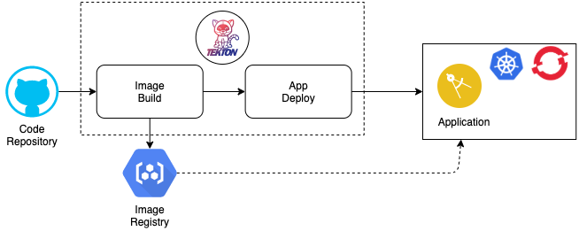
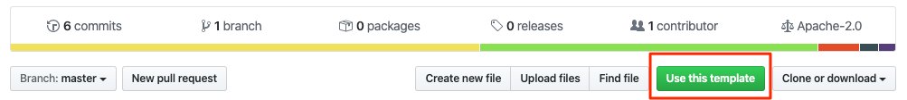
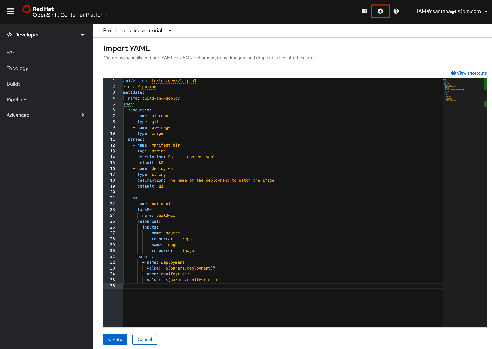
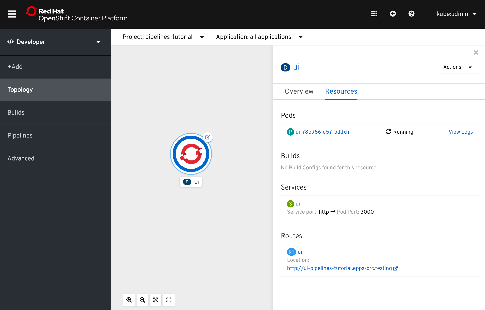

# OpenShift Pipelines Node.js Tutorial

- [OpenShift Pipelines Node.js Tutorial](#openshift-pipelines-nodejs-tutorial)
  * [Prerequisites](#prerequisites)
    + [Option 1 (learn openshift)](#option-1-learn-openshift)
    + [Option 2 (CRC)](#option-2-crc)
    + [Install the Tekton CLI](#install-the-tekton-cli)
    + [Get the tutorial](#get-the-tutorial)
  * [Run Application in a Container](#run-application-in-a-container)
    + [Build Container Image](#build-container-image)
    + [Run Container](#run-container)
  * [Pipeline Concepts](#pipeline-concepts)
  * [Install OpenShift Pipelines](#install-openshift-pipelines)
  * [Deploy Sample Application](#deploy-sample-application)
  * [Install Tasks](#install-tasks)
  * [Create Pipeline](#create-pipeline)
  * [Trigger Pipeline](#trigger-pipeline)

Welcome to the OpenShift Pipelines tutorial!





OpenShift Pipelines is a cloud-native, continuous integration and delivery (CI/CD) solution for building pipelines using [Tekton](https://tekton.dev). Tekton is a flexible, Kubernetes-native, open-source CI/CD framework that enables automating deployments across multiple platforms (Kubernetes, serverless, VMs, etc) by abstracting away the underlying details.

OpenShift Pipelines features:

-   Standard CI/CD pipeline definition based on Tekton
-   Build images with Kubernetes tools such as S2I, Buildah, Buildpacks, Kaniko, etc
-   Deploy applications to multiple platforms such as Kubernetes, serverless and VMs
-   Easy to extend and integrate with existing tools
-   Scale pipelines on-demand
-   Portable across any Kubernetes platform
-   Designed for microservices and decentralized teams
-   Integrated with the OpenShift Developer Console

This tutorial walks you through pipeline concepts and how to create and run a simple pipeline for building and deploying a containerized app on OpenShift.

In this tutorial you will:

## Prerequisites

You can use this repository as a template to create your own github repository.



You need an OpenShift 4 cluster in order to complete this tutorial.

### Option 1 (learn openshift)
You can use  a cluster from Learn OpenShift [OpenShift 4 Cluster Playground](https://learn.openshift.com/playgrounds/openshift42/)

Download oc from https://mirror.openshift.com/pub/openshift-v4/clients/oc/4.2/

Get the `oc` login command by login into the Console as `admin` then copy the command into the terminal


### Option 2 (CRC)
You can use the CodeReady Containers to run OpenShift on your workstation.
Follow the instructions [Installing CodeReady Containers](https://code-ready.github.io/crc/#installing-codeready-containers_gsg)

If using CRC, you need to run setup once:

```bash
crc setup
```

Then start using the `crc start` you can pass the pull secret file as a parameter the first time you run the command.

```bash
crc start -p ~/Downloads/pull-secret.txt
```

To access the OpenShift Console on CRC use the command

```bash
crc console
```

Setup the `oc` CLI for OpenShfit 4
```
eval $(crc oc-env)
```
Check the version is `4.2+`

### Install the Tekton CLI

You will also use the Tekton CLI (`tkn`) through out this tutorial. Download the Tekton CLI by following [instructions](https://github.com/tektoncd/cli#installing-tkn) available on the CLI GitHub repository.

For MacOS
```bash
curl -LO https://github.com/tektoncd/cli/releases/download/v0.7.1/tkn_0.7.1_Darwin_x86_64.tar.gz
# Extract tkn to your PATH (e.g. /usr/local/bin)
tar xvzf tkn_0.7.1_Darwin_x86_64.tar.gz -C /usr/local/bin tkn
chmod +x /usr/local/bin/tkn
```

For Linux
```
curl -LO https://github.com/tektoncd/cli/releases/download/v0.7.1/tkn_0.7.1_Linux_x86_64.tar.gz
tar xvzf tkn_0.7.1_Linux_x86_64.tar.gz -C /usr/local/bin tkn
chmod +x /usr/local/bin/tkn
```

Verify version
```bash
tkn version
```
Should be version `0.7.1`
```
Client version: 0.7.1
```
If you have an old version upgrade
```bash
brew upgrade tektoncd/tools/tektoncd-cli
```

### Get the tutorial

- Clone the Repository
```bash
git clone https://github.com/csantanapr/faststart2020-pipelines-lab.git
```
- Change directory
```bash
cd faststart2020-pipelines-lab/
```

## Run Application in a Container

To run the application in container you need to package the application into a container image and then run the container.

### Build Container Image

You will need a Dockerfile to be able to package you application into a container image.

Here is a very simple example of a `Dockerfile` :

```Dockerfile
FROM registry.access.redhat.com/ubi8/nodejs-12

CMD [ "npm", "start" ]

RUN mkdir app

WORKDIR app

ENV NODE_ENV=production

COPY src/package*.json ./

RUN npm ci

COPY src .
```

Having the last line as `COPY src .` allows for faster builds, skiping the installation of the dependencies.
Having a change for dependencies such as updating the files `src/package.*.json`, this will trigger a new layer be created using `RUN npm ci`. Using `NODE_ENV=prodction` allows the `npm ci` to skip dev dependencies and for any Node.js library that leverages the environment variable to run in production mode.

To be able to build the container image you will need a tool such as Docker Desktop that includes the docker CLI.

- Verify `Dockerfile` is present in current directory
```bash
ls Dockerfile
```

Run the following command to build the container image with tag `app:latest`

```bash
docker build -t app .
```

### Run Container

Run the container exposing the port 3000 from the application into your host, this will allow you to access the application in the same way it will run when deployed into OpenShift

```bash
docker run -p 3000:3000 app
```

You can access the application on `locahost:3000` with `curl` or your browser

```
open http://localhost:3000
```

Note: The command `docker run` can also be use to set environment variables or mount a directory inside the container.

## Pipeline Concepts

Tekton defines a number of [Kubernetes custom resources](https://kubernetes.io/docs/concepts/extend-kubernetes/api-extension/custom-resources/) as building blocks in order to standardize pipeline concepts and provide a terminology that is consistent across CI/CD solutions. These custom resources are an extension of the Kubernetes API that let users create and interact with these objects using `kubectl` and other Kubernetes tools.

The custom resources needed to define a pipeline are listed below:

-   `Task`: a reusable, loosely coupled number of steps that perform a specific task (e.g. building a container image)
-   `Pipeline`: the definition of the pipeline and the `Tasks` that it should perform
-   `PipelineResource`: inputs (e.g. git repository) and outputs (e.g. image registry) to and out of a pipeline or task
-   `TaskRun`: the execution and result of running an instance of task
-   `PipelineRun`: the execution and result of running an instance of pipeline, which includes a number of `TaskRuns`


In short, in order to create a pipeline, one does the following:

-   Create custom or install [existing](https://github.com/tektoncd/catalog) reusable `Tasks`
-   Create a `Pipeline` and `PipelineResources` to define your application's delivery pipeline
-   Create a `PipelineRun` to instantiate and invoke the pipeline

For further details on pipeline concepts, refer to the [Tekton documentation](https://github.com/tektoncd/pipeline/tree/master/docs#learn-more) that provides an excellent guide for understanding various parameters and attributes available for defining pipelines.

In the following sections, you will go through each of the above steps to define and invoke a pipeline.

## Install OpenShift Pipelines

OpenShift Pipelines is provided as an add-on on top of OpenShift that can be installed via an operator available in the OpenShift OperatorHub.

You can install the Operator from the CLI with the following command:

```bash
oc create -f pipeline/subscription.yaml
```

You can verify Pipelines control plane is running in the namespace `openshift-pipelines`

```bash
oc get pods -n openshift-pipelines
```

```bash
NAME                                           READY   STATUS    RESTARTS   AGE
tekton-pipelines-controller-7b6648dc8d-469g6   1/1     Running   0          2m
tekton-pipelines-webhook-65856dff6c-qdl99      1/1     Running   0          2m
```

An alternative to the CLI installation you can use the OpenShift Console UI, follow [these instructions](install-operator.md) in order to install OpenShift Pipelines on OpenShift via the OperatorHub.

## Deploy Sample Application

Create a project for the sample application that you will be using in this tutorial:

```bash
oc new-project pipelines-tutorial
```

OpenShift Pipelines automatically adds and configures a `ServiceAccount` named `pipeline` that has sufficient permissions to build and push an image. This
service account will be used later in the tutorial.

Run the following command to see the `pipeline` service account:

```bash
oc get serviceaccount pipeline
```

Open the OpenShift Web Console by switching over to the **Developer** perspective of the OpenShift web console. Change from **Administrator** to **Developer** from the drop down as shown below:


Make sure you are on the `pipelines-tutorial` project by selecting it from the **Project** dropdown menu. Either search for `pipelines-tutorial` in the search bar or scroll down until you find `pipelines-tutorial` and click on the name of your project.


## Install Tasks

Tasks consist of a number of steps that are executed sequentially. Each task is executed in a separate container within the same pod. They can also have inputs and outputs in order to interact with other tasks in the pipeline.

Here is an example of a ArgoCD task to sync and wait for an application update:

```yaml
apiVersion: tekton.dev/v1alpha1
kind: Task
metadata:
  name: argocd-task-sync-and-wait
spec:
  inputs:
    params:
      - name: application-name
        description: name of the application to sync
      - name: revision
        description: the revision to sync to
        default: HEAD
      - name: flags
        default: --
      - name: argocd-version
        default: v1.0.2
  stepTemplate:
    envFrom:
      - configMapRef:
          name: argocd-env-configmap  # used for server address
      - secretRef:
          name: argocd-env-secret  # used for authentication (username/password or auth token)
  steps:
    - name: login
      image: argoproj/argocd:$(inputs.params.argocd-version)
      command: ["/bin/bash", "-c"]
      args:
        - if [ -z $ARGOCD_AUTH_TOKEN ]; then
            yes | argocd login $ARGOCD_SERVER --username=$ARGOCD_USERNAME --password=$ARGOCD_PASSWORD;
          fi
    - name: sync
      image: argoproj/argocd:$(inputs.params.argocd-version)
      command: ["/bin/bash", "-c"]
      args:
        - argocd app sync $(inputs.params.application-name) --revision $(inputs.params.revision) $(inputs.params.flags)
    - name: wait
      image: argoproj/argocd:$(inputs.params.argocd-version)
      command: ["/bin/bash", "-c"]
      args:
        - argocd app wait $(inputs.params.application-name) --health $(inputs.params.flags)
```

When a task starts running, it starts a pod and runs each step sequentially in a separate container on the same pod. This task happens to have a single step, but tasks can have multiple steps, and, since they run within the same pod, they have access to the same volumes in order to cache files, access configmaps, secrets, etc. As mentioned previously, tasks can receive inputs (e.g. a git repository) and produce outputs (e.g. an image in a registry).

Note that only the requirement for a git repository is declared on the task and not a specific git repository to be used. That allows tasks to be reusable for multiple pipelines and purposes. You can find more examples of reusable tasks in the [Tekton Catalog](https://github.com/tektoncd/catalog) and [OpenShift Catalog](https://github.com/openshift/pipelines-catalog) repositories.

Install the `build-ui` task from the repository using `oc` or `kubectl`, which you will need for creating a pipeline in the next section:

```bash
oc create -f pipeline/build-ui.yaml
```

The `build-ui` task uses the directory [k8s/](./k8s) as default location for the Kubernetes YAML manifests to configure the Kubernetes resources. In this case we are building a `Deployment`, `Service`, and `Route`. We use an invalid placeholder image in [deployment.yaml](./k8s/deployment.yaml) so that Tekton does not deploy an application until the correct image is configured. The step `oc-deploy`in the task, when run after `build-image`, will then set the correct image into the deployment.


You can take a look at the task you created using the [Tekton CLI](https://github.com/tektoncd/cli/releases):

```bash
tkn task ls
```

```bash
NAME                AGE
build-ui            10 seconds ago
```

We will be using the `buildah` in the task on the first step `build-image` the image url will be dynamically generated using the current namespace, and using the git repo commit HASH to use it as unique image tag.

## Create Pipeline

A pipeline defines a number of tasks that should be executed and how they interact with each other via their inputs and outputs.

In this tutorial, you will create a pipeline that takes the source code of the application from GitHub and then builds and deploys it on OpenShift.


Here is the YAML file that represents the above pipeline:

```yaml
apiVersion: tekton.dev/v1alpha1
kind: Pipeline
metadata:
  name: build-and-deploy
spec:
  resources:
    - name: ui-repo
      type: git
    - name: ui-image
      type: image
  params:
    - name: manifest_dir
      type: string
      description: Path to context yamls
      default: k8s
    - name: deployment
      type: string
      description: The name of the deployment to patch the image
      default: ui

  tasks:
    - name: build-ui
      taskRef:
        name: build-ui
      resources:
        inputs:
          - name: source
            resource: ui-repo
          - name: image
            resource: ui-image
      params:
        - name: deployment
          value: "$(params.deployment)"
        - name: manifest_dir
          value: "$(params.manifest_dir)"
```

This pipeline performs the following:

1. Clones the source code of the frontend application from a git repository (`ui-repo` resource)
2. Builds the container image using the `build-ui` task that uses [Buildah](https://buildah.io/) to build the image
3. The application image is pushed to an image registry (`ui-image` resource)
4. The `oc-deploy` step in the task is run, thus creating a `Deployment`, `Service`, and `Route` and sets the new image for the container in the deployment.

You might have noticed that there are no references to the git
repository or the image registry it will be pushed to in the Pipeline. That's because pipeline in Tekton
are designed to be generic and re-usable across environments and stages through
the application's lifecycle. Pipelines abstract away the specifics of the git
source repository and image to be produced as `PipelineResources`. When triggering a
pipeline, you can provide different git repositories and image registries to be
used during pipeline execution. Be patient! You will do that in a little bit in
the next section.


Create the pipeline by running the following:

```bash
oc create -f pipeline/pipeline.yaml
```

Alternatively, in the OpenShift web console, you can click on the **+** at the top right of the screen while you are in the **pipelines-tutorial** project:



Check the list of pipelines you have created using the CLI:

```bash
tkn pipeline ls
```

```bash
NAME               AGE            LAST RUN   STARTED   DURATION   STATUS
build-and-deploy   1 minute ago   ---        ---       ---        ---
```

## Trigger Pipeline

Now that the pipeline is created, you can trigger it to execute the tasks
specified in the pipeline.

First, you should create a number of `PipelineResources` that contain the specifics of the git repository and image registry to be used in the pipeline during execution. Expectedly, these are also reusable across multiple pipelines.

The following `PipelineResource` defines the git repository for the frontend application:

```yaml
apiVersion: tekton.dev/v1alpha1
kind: PipelineResource
metadata:
  name: ui-repo
spec:
  type: git
  params:
    - name: url
      value: https://github.com/csantanapr/faststart2020-pipelines-lab
    - name: revision
      value: master
```

And the following defines the OpenShift internal image registry for the frontend image to be pushed to. Notice that the the task will replace `$NAMESPACE` and will add the image tag (ie :12234) at the end of the image url:

```yaml
apiVersion: tekton.dev/v1alpha1
kind: PipelineResource
metadata:
  name: ui-image
spec:
  type: image
  params:
    - name: url
      value: image-registry.openshift-image-registry.svc:5000/$NAMESPACE/ui
```

Create the above pipeline resources via the OpenShift web console or by running the following:

```bash
oc create -f pipeline/resources.yaml
```

> **Note** :-
>
> If you are not into the `pipelines-tutorial` namespace, and using another namespace for the tutorial steps, please make sure you update the
> frontend and backend image resource to the correct url with your namespace name like so :
>
> `image-registry.openshift-image-registry.svc:5000/<namespace-name>/api:latest`

You can see the list of resources created using `tkn`:

```bash
tkn resource ls
```

```bash
NAME       TYPE    DETAILS
ui-repo    git     url: https://github.com/csantanapr/faststart2020-pipelines-lab
ui-image   image   url: image-registry.openshift-image-registry.svc:5000/pipelines-tutorial/ui:latest
```

A `PipelineRun` is how you can start a pipeline and tie it to the git and image resources that should be used for this specific invocation. You can start the pipeline using `tkn`:

```bash
tkn pipeline start build-and-deploy -s pipeline
```

```bash
? Choose the git resource to use for ui-repo: ui-repo (https://github.com/csantanapr/faststart2020-pipelines-lab)
? Choose the image resource to use for ui-image: ui-image (image-registry.openshift-image-registry.svc:5000/pipelines-tutorial/ui:latest)
Pipelinerun started: build-and-deploy-run-z2rz8
Showing logs...

```

Note: The `-s` flag in the command specifies the `ServiceAccount` to use for the `PipelineRun`, this is the `ServiceAccount` we saw earlier and contains secrets to push and pull to the internal image registry.

And it will start streaming the logs of the pipeline we just triggered.

As soon as you start the `build-and-deploy` pipeline, a `PipelineRun` will be instantiated and pods will be created to execute the tasks that are defined in the pipeline.

```bash
tkn pipeline list
```

```bash
NAME               AGE             LAST RUN                     STARTED          DURATION   STATUS
build-and-deploy   6 minutes ago   build-and-deploy-run-z2rz8   36 seconds ago   ---        Running

```

Check out the logs of the `PipelineRun` as it runs using the `tkn pipeline logs` command which interactively allows you to pick the `PipelineRun` of your interest and inspect the logs:

```bash
tkn pipeline logs -f
```

```bash
? Select pipeline : build-and-deploy
```

After a few minutes, the pipeline should finish successfully.

```bash
tkn pipeline list
```

```bash
NAME               AGE              LAST RUN                     STARTED         DURATION    STATUS
build-and-deploy   11 minutes ago   build-and-deploy-run-z2rz8   5 minutes ago   5 minutes   Succeeded
```

You can go to **Developer-Pipeline** and see the resulting PipelineRun:


Go to the Topology view, you should see that the images are successfully built and deployed.



You can get the route of the application by executing the following command and access the application

```bash
oc get route ui --template='http://{{.spec.host}}'
```

If you want to re-run the pipeline again, you can use the following short-hand command to rerun the last `PipelineRun` again that uses the same pipeline resources and service account used in the previous pipeline run:

```bash
tkn pipeline start build-and-deploy --last --showlog
```
